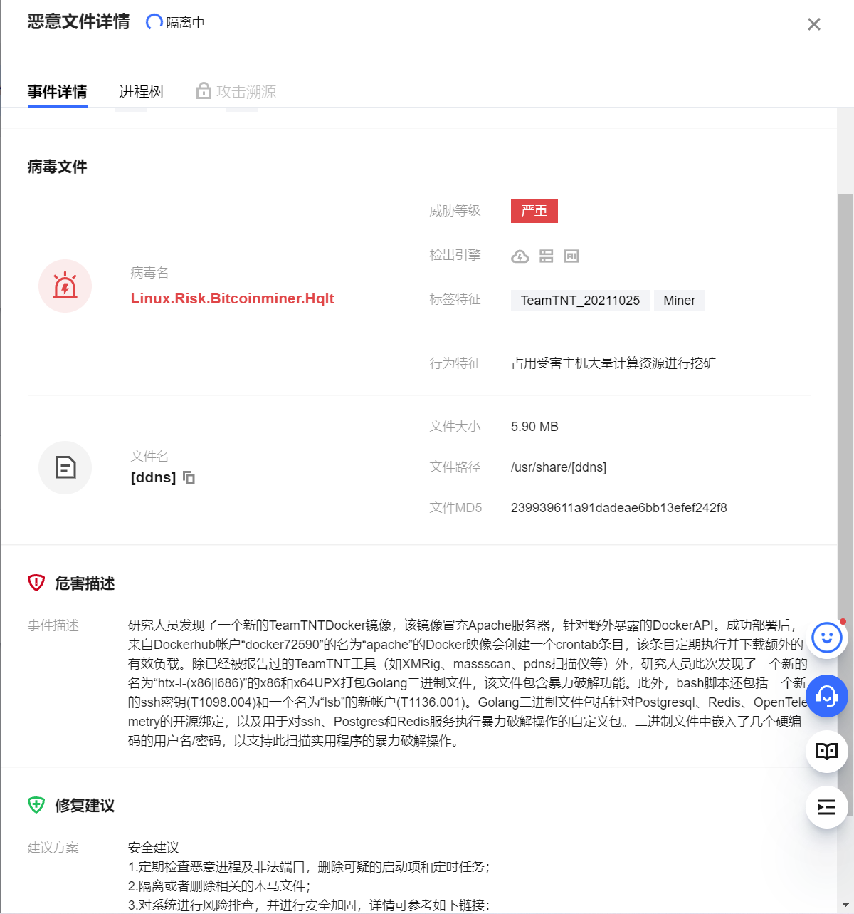
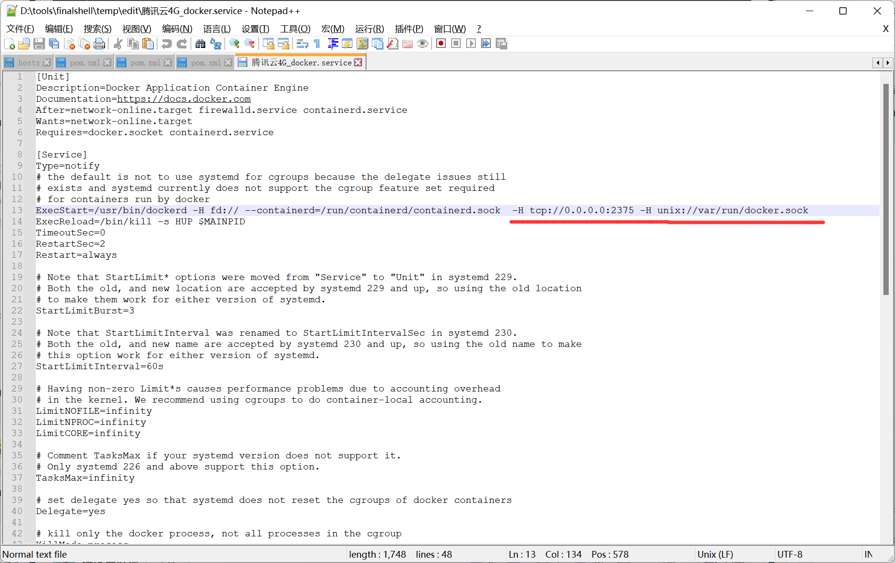

> 服务器不知道怎么中挖矿病毒了，真的不知道怎么办，就重装了。呜呜呜



1. 编辑这个文件
/lib/systemd/system/docker.service

2. 加上 `-H tcp://0.0.0.0:2375 -H unix://var/run/docker.sock`
如图



3. 重新加载配置文件并重启docker：

```bash
systemctl daemon-reload && systemctl restart docker

```


## 所以为什么我中毒了

我就是按照了上面的操作，那么他们是怎么操作的。
下面这篇文章有介绍。。是如何通过Docker 2375 端口入侵服务器。
[http://www.dockerinfo.net/1416.html](http://www.dockerinfo.net/1416.html)


## 所以应该换个端口

就像这样

```bash
-H tcp://0.0.0.0:2376 -H unix://var/run/docker.sock
```

参考链接 [远程连接docker daemon，Docker Remote API](https://deepzz.com/post/dockerd-and-docker-remote-api.html)